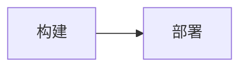

# 开发指南

## 目录结构

```
astro.config.mjs          # site/base、Fonts API、Mermaid、sitemap lastmod
src/
  content.config.ts       # posts/projects 集合 schema（校验约束见内容规范）
  content/
    posts/                # 文章 md（template-*.md 不参与构建）
    projects.yaml         # 项目数据（首页 Bento / 项目页）
  data/
    tokens-base.css       # 基础层：重置、间距、系统字体栈、无 JS 兜底
    swiss-tokens.css      # 皮肤 A（展示层）：亮 / 手动暗 / 媒体查询暗
    ink-tokens.css        # 皮肤 B（内容层）：同上
    fonts.css             # CJK 子集 @font-face（懒加载）
    themes.ts             # 主题状态机（localStorage 'theme-preference'）
  layouts/
    Base.astro            # HTML 外壳：FOUC 脚本、meta/OG/JSON-LD、Font 组件
    SwissLayout.astro     # 展示页容器（点阵背景）
    InkLayout.astro       # 文章页容器（68ch prose、Mermaid 样式）
  components/             # Header/Footer/Wordmark/ThemeToggle/卡片/PrevNext…
  pages/                  # 路由：/ /blog /blog/[id] /projects /tags /about /404
  lib/projects.ts         # projects.yaml 读取
scripts/
  verify-ui.mjs           # Playwright DOM 断言（dev server 需运行中）
  preflight.mjs           # 构建后完整性 + 字符集检查
  build-charset.mjs       # 收集站点 CJK 字符 → charset.txt
  subset-cjk.ps1          # 字体子集化（fonttools）
  screenshot-check.mjs    # 截图存档（dist 预览）
```

## 主题系统（四象限）

`html[data-skin]` × `html[data-theme]` 组合，token 定义在皮肤文件内：

| | 亮 | 暗 |
| --- | --- | --- |
| `swiss` | #F5F3EE / IKB #2B3FEB | #111 / 柠檬 #E8D113 文字强调 |
| `ink` | 暖纸 #F7F2E7 / 赭石 #A3562A | 深墨 #1C1A17 / 暖赭 #C77B4E |

- 暗色**文字级**强调一律柠檬黄；IKB 只做色块/按钮底（对比度规则见《博客UI设计.md》§3）
- 无 JS 时走 `prefers-color-scheme` 媒体查询；JS 正常由 Base.astro 首位内联脚本接管

## 字体体系

| 用途 | 字体 | 来源 |
| --- | --- | --- |
| swiss 展示（标题/字标） | Archivo Black | Fonts API（fontsource） |
| swiss 正文 | Space Grotesk 400/500/700 | Fonts API |
| ink 展示 | Playfair Display 700/900 | Fonts API |
| ink 正文 | Source Serif 4 600/700 | Fonts API |
| 元信息 | JetBrains Mono 400/500 | Fonts API |
| CJK 标题 | Noto Serif/Sans SC 700 子集 | scripts/subset-cjk.ps1 |

- Fonts API 在 Base.astro 用 `<Font cssVariable preload={skin === ...} />` 注入；
  **不预载 CJK**（懒加载，仅文章页触发）
- 皮肤文件里 `--font-display` 由 `--fw-*`（Fonts API 变量）+ `--fw-cjk-*` 拼接

## Mermaid



- 配置在 `astro.config.mjs`：`processor: unified({ rehypePlugins: [[rehypeMermaid, { strategy: 'img-svg', dark: true }]] })`
- 渲染为 `<picture>` 内联 SVG（`mermaid-dark-*` / `mermaid-light-*` 双源）
- 样式在 `InkLayout.astro` 的 `.prose picture`

## 已知坑（Astro 7）

- `excludeLangs` 在 `markdown.syntaxHighlight`，不在 `shikiConfig`（否则 shiki 先高亮 mermaid 块，rehype-mermaid 失效）
- 内容集合 v2：文章 `id` 才是文件名（旧 `post.slug` 已删）；`projects.yaml` 条目的 `slug` 是数据字段
- 渲染文章用 `render(post)`（`astro:content`），不是 `post.render()`
- `astro:content` 不能在 config 里 import（sitemap lastmod 用 js-yaml 直读 frontmatter）
- `getStaticPaths` 模块级提升：`await getCollection` 必须在函数内部
- `.ts` 端点（rss.xml.ts）不能带 `---` frontmatter
- scoped `<style>` 不作用全局 `body`（已集中到 Base.astro 的 `is:global`）

## 常用命令

```bash
npm run dev          # 本地开发（http://localhost:4321/blog/）
npm run build        # 构建 dist/
npm run preflight    # 构建后完整性 + 字符集检查
npm run verify       # 需 dev server 运行中；Playwright 全页断言
```
