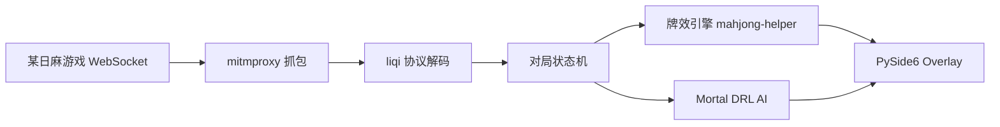

> 一句话结论：把"抓包 → 通用 protobuf 解码 → 状态机 → 本地 DRL 推理"这条链打通后，一个实时牌局助手就从"能看"变成了"能建议"，而其中 80% 的工时花在了处理真实数据的脏活上，不是算法本身。

## 背景与动机

打麻将打多了之后，我发现自己有两个痛点：一是副露和听牌效率算不清，二是不知道"这一手到底该防守还是进攻"。市面上有现成的牌效计算器，但它的输出是"哪张牌进张最多"，不会告诉你立直时机、不会评估全局局势。

于是我起了个念头：既然有开源的日麻 AI（天凤十段水平），能不能把它接进来，和牌效建议并排显示？AI 的 Q 值说"打这张"，牌效说"打那张"，分歧出现时我自己判断——这就是项目的初心：**工具不替我做决定，只给我第二意见**。

## 技术方案总览

整条链是管道式的：



三个关键决策：

1. **用 mitmproxy 做中间人**，而不是抓包工具导 pcap。理由：WebSocket 解帧 + Python 插件钩子一条龙，`websocket_message` 钩子直接拿到裸字节，省掉一整层流量分析。
2. **不依赖 protoc 生成代码**，写了一个 schema 驱动的通用 protobuf 线格式解码器。协议 schema 是社区逆向好的 JSON（210KB），运行时按类型名查字段表递归解码。好处是协议更新时只换 JSON，坏处是容错代码要自己扛。
3. **Mortal 引擎进程内集成**，不用子进程。单次推理约 2ms（CPU），模型加载 300ms，回放 1411 帧只要 2.7 秒——进程内调用的开销几乎可以忽略。

## 实现过程：三个阶段

### 阶段一：协议逆向（耗时最多）

第一步是摸清帧格式。最终确定的结构很简单：

```
byte[0]        消息类型（1=Notify, 2=Req, 3=Res）
bytes[1:3]     消息 id（uint16 LE，仅 Req/Res）
其余           protobuf Wrapper { name: string, data: bytes }
```

但"简单"是事后视角。实际卡在两层嵌套：外层 wrapper 解出来之后，`ActionPrototype` 又套了一层（step/name/data），不按类型名正确 resolve 的话，`HuleInfo`、`FanInfo` 这些嵌套消息全都会退化成数字字段加 hex 字符串。这个修复过程很典型：先看到"能出牌了"，再看到"胡牌信息全是 f1/f2 数字"，最后才定位到 `ftype.startswith(".")` 这个一行 bug。

配套写了一个手工验证脚本 `test_ws.py`：从 CONNECT 隧道 → TLS → WebSocket Upgrade 一步步手动握手，确认代理链路每层都通。这种"把链路拆开逐层验证"的做法后来救了我好几次。

### 阶段二：状态机与牌效工具链

协议是"事件流"，不是"状态"。所以核心是 `StateMachine`：维护手牌、牌河、副露、宝牌指示器、立直棒、当前巡目，把 10 种 notify 消息翻译成内部状态。

最难的坑是**庄家推导**：`ActionNewRound` 没有 `oya` 字段。实测规律是——自家 14 张牌就是庄家，自家 13 张则首个 `ActionDealTile` 的座位是庄家。这种"没有文档，只有实测"的规律，就是逆向项目的日常。

牌效引擎用 mahjong-helper 的 CLI 封装：`subprocess.run(timeout=15)` 执行 exe，再用正则解析它的中文输出（"切5饼"、"[27.13速度] [平和 断幺]"）。正则解析别人家的 CLI 输出，糙，但 15 分钟就能跑通，不用读 C# 源码。

### 阶段三：Mortal AI 接入

Mortal 官方权重不公开，社区包 Akagi v2（Apache-2.0）内置了 libriichi 引擎和社区模型。接入过程遵循里程碑推进：先写转换器和假引擎联调（M1-M2），再换真引擎（M3），最后做融合展示（M4）。

转换器要把 liqi 事件翻译成 MJAI 事件，还要处理一个反直觉的细节：`start_kyoku` 不能立刻发，得等座位和庄家确定后**延迟 flush**，然后把手牌缓冲回放成 tsumo 事件。桥接层用了懒加载：`_load_engine()` 在第一次需要时才 import，并把 loguru 的默认 handler 静音掉，否则引擎的 stderr 噪音会淹没自己的日志。

实测结果：1411 帧全量回放，**0 非法事件**，4 局 54 个引擎决策（出牌 50 / 碰 2 / 立直 2），Q 值 Top-3 出牌候选能稳定显示在 Overlay 上。

## 踩坑记录

| 坑 | 现象 | 解决 |
| --- | --- | --- |
| 嵌套 protobuf 退化 | 胡牌信息全是 f1/f2 数字+hex | `ftype.startswith(".")` 改为按类型名 resolve |
| 庄家无字段 | 不知道谁是亲家 | 实测规律：自家 14 张=庄家；否则首个发牌座位是庄家 |
| `end_kyoku` 缺失 | 报 "discard F from void" | 每局结束必须发 end_kyoku，引擎状态才复位 |
| 副露方向搞反 | 吃碰后手牌错位 | `froms[-1]` 是放牌者、`tiles[-1]` 是被鸣牌，不是直觉上那样 |
| `reach_accepted` 必需 | 立直后引擎状态错乱 | 立直宣布事件之外还要发 accepted 事件 |
| Akagi 要数组 | 传单事件报错 | `react([evt])` 而不是 `react(evt)` |
| 引擎崩溃 | Overlay 白屏 | `_mortal_failed` 永久降级，牌效建议不受影响 |
| 三麻 4 槽位 | 三麻引擎数据错位 | 4 槽位格式补齐 + 3 家轮转验证 |

## 用到的工具与 AI 协作

- **mitmproxy 12**：抓包 + WebSocket 解帧 + 插件体系，全链路的基石
- **PySide6**：无边框置顶悬浮窗，`Ctrl+Alt+D` 切换鼠标穿透（避开 WS_EX_LAYERED 与 Qt 透明窗口的冲突）
- **torch CPU**：2.13.0+cpu，单机推理 2ms，模型 5MB 级
- **AI 协作**：这个项目基本是 AI 辅助开发出来的。我的用法是——AI 写骨架和常规胶水代码（UI 布局、参数解析、正则初版），我负责架构决策（进程内 vs 子进程、schema 驱动 vs protoc）、协议边界验证、以及所有"数据不对劲"时的排查。AI 最大的价值不是写代码，而是把"协议逆向"这种活从十几个小时压到两三个小时。

## 经验总结

1. **逆向项目的第一生产力是"能复现的抓包数据"**。`testdata/ws_replay.jsonl`（1411 帧）让我不用开游戏就能回归测试，这个数据集比任何文档都值钱。
2. **状态机是中间层，不是终点**。有了状态机，牌效引擎、MJAI 桥、Overlay 全部变成"状态机的消费者"，后面的扩展都是加消费者，不是改管道。
3. **降级路径要设计在架构里**。引擎挂了、模型加载失败了，牌效建议不能一起消失——`_mortal_failed` 永久降级这个设计，让整个工具在 AI 部分随时可以拔掉。
4. **实测规律要写进文档**。庄家推导、副露方向这些靠实测摸出来的规律，不写下来三个月后就是重新踩一遍。
5. **工程化欠债会反噬**：项目没有 requirements.txt、不是 git 仓库、没有 README。功能做到 80% 的时候这些不痛，做到 M5（稳定性）阶段全都会变成问题。

## 下一步计划

- M5 稳定性：长局测试、断线重连、崩溃恢复
- 补上依赖清单、git 初始化、README——把工程化欠债还掉
- 连杠/四杠散等边缘局面的引擎覆盖验证
- 把"分歧时显示 AI 判断依据"做成真正可解释的展示

> 声明：本文仅为协议分析与软件工程技术的学习记录，不涉及绕过安全防护、自动化操作游戏或任何作弊行为，内容仅供学习研究使用。
