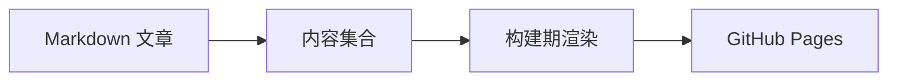

---
# ============================================================
# 模板 03 · 教程（含代码块与 Mermaid 图）
# Mermaid 支持 graph LR / sequenceDiagram / classDiagram 等
# （构建期渲染为内联 SVG，亮暗主题各一份）。
# ============================================================
title: 手把手教程：用 Astro 搭建双主题个人博客（替换成 20 字以上标题）
pubDate: 2026-08-10
description: 分步教程，40 到 160 字之间描述读者能学到什么、需要什么前置条件，一定要写够长度。
category: 教程
tags: [Astro, 教程, 前端]
draft: true
---

## 前置条件

- Node.js 20+
- 基础命令行知识

## 步骤一：初始化项目

```bash
npm create astro@latest my-blog -- --template minimal
```

## 步骤二：架构总览



## 步骤三：主题切换

在 `src/data/themes.ts` 中管理 `theme-preference`。

## 踩坑记录

| 问题 | 原因 | 解决 |
| ---- | ---- | ---- |
| excludeLangs 不生效 | Astro 7 移键 | 改放 `markdown.syntaxHighlight` |

> 提示：正文用系统字体，标题字体子集化自托管，LCP 有保障。
